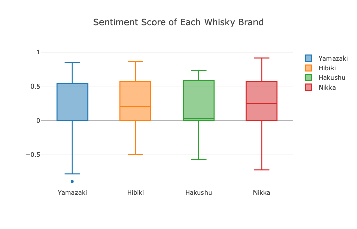
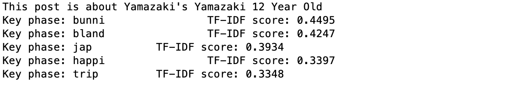
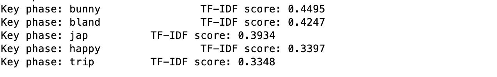

# Japanese Whisky Reviews

There is a Japanese Whisky Review data set available in Kaggle, that the data set is  originated from Master of Malt. I am interested in doing some NLP works on this data set.  
I will be making some analysis on the sentiment of the reviews and try to summarize the individual review.
 

## Tools
In this project, I will be using packages like SKlearn, vaderSentiment, ntlk for sentiment scores and TF-IDF.  

## Data set
The data set could be found in <a href="https://www.kaggle.com/koki25ando/japanese-whisky-review">Kaggle</a>. It consists of 4 columns including, bottle label, brand name, title of the review and the review content. The data set only covers 4 Japanese whisky brands -- Yamazaki, Hibiki, Hakushu, and Nikka.

## Sentiment Analysis
The first task is to understand the sentiment scores across brands.
 
First, I have used vaderSentiment to calculate the sentiment score for each review. Then, I used Plotly to visualize the range of sentiment score of each brand with a boxplot. It looks like this.   

 
From the boxplot, we can learn that reviewers in general have a positive view on the Japanese whiskies, while they have better impression on Nikka and Hibiki. Interestingly, the median sentiment score on Yamazaki is 0, which means neutral.
 
You may find the code <a href="jpwhisky_review_sentiment.py">here</a>

## TF-IDF
The second task is to build a model that shows the summary by displaying the top 5 key words in the review. To do this, I use TfidfVectorizer from sklearn.feature_extraction.text to build the model. To preprocess the texts, I used the same package to remove English stop words and nltk to stem the words.
 
There are 2 files of code for this task: <a href="jpwhisky_review_tfidf.py">jpwhisky_review_tfidf.py</a> is the backend, and <a href="driver.py">driver.py</a> will provoke the implementation and display result.
  
I don't like the first version of the displaying system because it shows the stemmed word as summary, like this:  

  
I add a feature that once the model produce the result for a review post, driver.py will grab the original post and pair the word from original post with the stemmed word in a dictionary, then it will display the word from original post, like this:  
